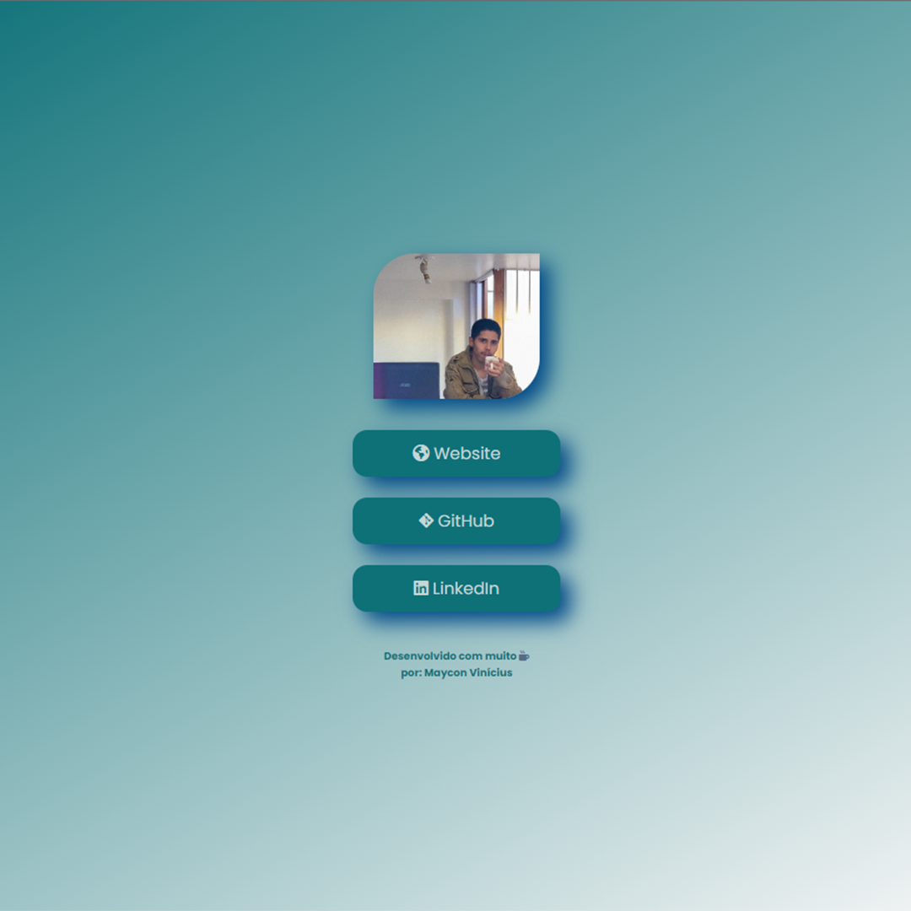

# Projeto de links úteis.
Nesse projeto tive a ideia de fazer uma espécie de linktree para uso do alguns links que considero úteis. 

O mesmo foi totalmente criado para uso na bio do Instagram, podendo ser usado também em outras redes socais.

A idealização desse projeto foi iniciado com o desejo de ter um 'linktree' personalizado e desenvolvido por mim. Juntamente com o domínio adequado para isso.  

- Tecnologias usadas nesse projeto.
    

        
        
    

### Imagem do projeto finalizado.

